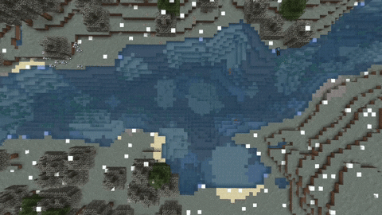

# ☀️ Saisons

## <mark style="color:yellow;">Classement saisonnier</mark>

Tous les 15 jours, un item est désigné. Farmez-le et déposez-le pour faire grimper votre île dans le classement saisonnier !

Pour accéder au menu du classement saisonnier et ainsi déposer l'item désigné, vous tapez <mark style="color:red;">`/ob points`</mark>.

<figure><figcaption></figcaption></figure>

💡Le bouton de gauche vous donnera **toutes** les informations concernant la saison en cours. Celui de droite vous permet de déposer l’item désigné ainsi que le nombre de **points** gagnés.

## <mark style="color:yellow;">Les différentes saisons</mark>

Chaque saison aura une influence sur l’environnement de votre île et changera tous les 15 jours. 

🌸 <mark style="color:green;">Printemps</mark>

* Les feuilles des forêts deviendront roses et l’eau aura une légère teinte bleu clair.
* La fleur de cerisier tombe des feuilles.

- Le ciel est de couleur bleu clair.
- Les fleurs peuvent être trouvées partout.
- La neige et la glace générées en hiver seront enlevées.
- Beaucoup de moutons, de vaches, de cochons, de lapins et de poulets produiront, chacun avec 3 à 5 bébés.

* Augmentation du taux d’apparition des abeilles.
* Température moyenne de 5°C-23°C, selon le biome.

☀️ <mark style="color:green;">Été</mark>

* Dans la plupart des biomes, les arbres et l’herbe ont une couleur verte vibrante semblable aux feuilles de la jungle.
* Le biome Taïga aura la couleur de l’herbe des plaines.
* La neige et la glace générées en hiver seront enlevées.

- Les biomes chauds (désert, savane) semblent un peu secs.
- La couleur de l’eau et du ciel est bleu clair.

* Les fleurs placées au printemps sont enlevées.
* Feuilles tombent des arbres.
* Des touffes de baies apparaissent partout.
* La pluie est très rare.
* Les animaux qui apparaissent normalement dans la jungle peuvent désormais apparaître partout.
* Les cultures et plantes pousseront deux fois plus vite si rien ne se trouve au-dessus d’elles.

- La température moyenne sera comprise entre 25°C et 40°C, selon le biome, ce qui peut vous faire transpirer (particules d'eau).

🎃 <mark style="color:green;">Automne</mark>

* Les arbres se transforment en toutes sortes de couleurs : orange, bleu, vert, jaune et brun.
* L’herbe a une couleur boueuse brun clair.
* Le ciel a une couleur grise.
* L’eau est brune et semble boueuse.
* De grandes plaques de champignons apparaissent.
* La pluie et les orages seront plus fréquents.
* De petites particules (feuille tombante) apparaîtront sous les arbres.
* Les chauves-souris frayent au-dessus du sol la nuit.
* Des champignons, des grenouilles et des renards apparaissent partout.
* Des araignées supplémentaires peuvent être trouvées la nuit et parfois même des araignées des cavernes.
* La température moyenne sera comprise entre 5°C et 25°C, selon le biome.
* Les monstres ont 20 % de chances d’apparaître avec une citrouille sur la tête.
* La durée du jour et de la nuit est presque égale.
* Les arbustes à baies générés par l’été sont enlevés.

❄️ <mark style="color:green;">Hiver</mark>

* Les feuilles et l’herbe ont une teinte gris clair.
* Le ciel est un peu plus blanc.
* L’eau est bleu foncé.
* Tous les blocs d’eau exposés, sans rien au-dessus, finiront par geler avec le temps.\
  

- Il neige au lieu de pleuvoir. La texture de neige réelle de Minecraft vanilla est utilisée. La neige sera de nouveau enlevée à la saison suivante.
- Les nuits seront longues (environ 13 min) et les journées seront courtes (environ 7 min).&#x20;
- Loups, renards blancs, ours polaires et bonhommes de neige (sans citrouille) se trouvent partout.
- Des animaux errants apparaîtront à la place des squelettes.

* Les cultures et plantes ne pousseront que si un bloc se trouve au-dessus d’elles.
* La température moyenne sera comprise entre -10°C et 5°C, selon le biome ce qui donne la sensation de froid et fera souffler de la brume.

