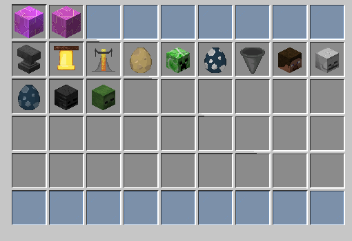

# 🏝️ Îles

Les îles sont un espace où chaque joueur peut construire sa propre base à partir d'un bloc initial. Vous pouvez y développer des fermes, des systèmes d’automatisation et bien plus, en utilisant les ressources obtenues via votre Oneblock. En progressant, vous débloquez de nouveaux biomes et types de ressources, encourageant l'exploration et l'expansion de votre territoire, rendant le jeu plus interactif et dynamique.\

## <mark style="color:yellow;">Utilisation</mark>

🏝️ <mark style="color:green;">Créer son île</mark> 

Pour créer votre île, utilisez la commande <mark style="color:red;">`/ob create`</mark>. Vous serez téléporté directement sur votre nouvelle île. Une fois créée, vous aurez accès au menu suivant avec la commande <mark style="color:red;">`/ob`</mark>.

<figure><figcaption></figcaption></figure>

* <mark style="color:yellow;">Téléporter</mark> **:** Améliorez votre île ou utilisez <mark style="color:red;">`/ob go`</mark>.
* <mark style="color:yellow;">Phases</mark> **:** Accédez à vos phases ou tapez <mark style="color:red;">`/ob phases`</mark>.
* <mark style="color:yellow;">Amélioration</mark> **:** Accédez aux améliorations de l'île ou utilisez <mark style="color:red;">`/ob upgrade`</mark>.
* <mark style="color:yellow;">Équipe</mark> **:** Consultez les membres de l'île ou tapez <mark style="color:red;">`/ob team`</mark>.
* <mark style="color:yellow;">L'engrenage</mark> **:** Accédez à vos paramètres avec votre clic gauche et à vos permissions avec votre clic droit ou faites <mark style="color:red;">`/ob settings`</mark> - <mark style="color:red;">`/ob permissions`</mark>.

- <mark style="color:yellow;">Le podium</mark> : Consultez le classement saisonnier des îles ou utilisez <mark style="color:red;">`/ob top`</mark>.
- <mark style="color:yellow;">Bloc de terre</mark> : Consultez la saison en cours et déposez les objets demandés pour augmenter le score de votre île ou faites <mark style="color:red;">`/ob points`</mark>.
- <mark style="color:yellow;">La croix</mark> : Supprimez votre île actuelle pour repartir de zéro, ou utilisez <mark style="color:red;">`/ob reset`</mark>.
- <mark style="color:yellow;">La pièce</mark> : Consultez, retirez ou déposez votre argent dans la banque d'île, ou tapez <mark style="color:red;">`/ob bank`</mark>.
- <mark style="color:yellow;">Biomes</mark> : Changez le biome de votre île, ou utilisez <mark style="color:red;">`/ob biome`</mark>.

⚙️ <mark style="color:green;">Paramétrer mon île</mark>

Pour gérer vos paramètres d'île, tapez la commande <mark style="color:red;">`/ob settings`</mark>. Le menu suivant s'ouvrira :

<figure><figcaption></figcaption></figure>

Pour gérer vos permissions d'île, tapez la commande <mark style="color:red;">`/ob permissions`</mark>. Le menu suivant s'ouvrira :

<figure><figcaption></figcaption></figure>

🚹 <mark style="color:green;">Inviter un joueur sur mon île</mark>

Pour inviter un joueur à rejoindre votre île, utilisez la commande <mark style="color:red;">`/ob invite "pseudo"`</mark>. Votre ami devra ensuite taper **deux fois** la commande <mark style="color:red;">`/ob accept`</mark> (avec un délai de 10 secondes entre chaque).

#### Les grades d'île disponibles sont les suivants :

<figure><figcaption></figcaption></figure>

Pour promouvoir un membre de votre île, utilisez la commande <mark style="color:red;">`/ob promote "pseudo"`</mark>. Pour rétrograder un joueur, tapez <mark style="color:red;">`/ob demote "pseudo"`</mark>.

:bulb: Le grade "<mark style="color:blue;">**Coop**</mark>" permet au joueur d'avoir des permissions uniquement lorsque le propriétaire de l'île est connecté. Cependant vous pouvez attribuer des permissions spécifiques à un joueur en tapant la commande <mark style="color:red;">`/ob permissions "pseudo"`</mark>.

💪🏻 <mark style="color:green;">Améliorer mon île</mark>

Vous pouvez acheter des améliorations pour votre île en tapant la commande <mark style="color:red;">`/ob upgrade`</mark>..png>)

* <mark style="color:yellow;">Barrière</mark> **:** Augmentez la taille de votre île.
* <mark style="color:yellow;">Bloc d'herbe</mark> **:** Changez la phase de votre île.
* <mark style="color:yellow;">Émeraude</mark> **:** Augmentez la limite d'entonnoirs sur votre île.
* <mark style="color:yellow;">Pierre</mark> **:** Achetez ou changez votre générateur d'île. Quatre types sont disponibles :&#x20;
  * Générateur Normal
  * Générateur Naturel
  * Générateur à Minerais
  * Générateur du Nether\

🔧 <mark style="color:green;">Restrictions</mark>

Vous pouvez accéder aux limites de votre île avec la commande <mark style="color:red;">`/ob limits`</mark>, qui vous ouvrira ce menu :&#x20;

* <mark style="color:yellow;">Enclume</mark> → 150
* <mark style="color:yellow;">Cloche</mark> → 50
* <mark style="color:yellow;">Alambic</mark> → 100
* <mark style="color:yellow;">Morue</mark> → 15&#x20;
* <mark style="color:yellow;">Tête de creeper</mark> → 50
* <mark style="color:yellow;">Dauphin</mark> → 15&#x20;
* <mark style="color:yellow;">Entonnoir</mark> → 100
  * Vous pouvez toutefois améliorer cette limite en allant dans le menu <mark style="color:red;">`/ob upgrade`</mark> puis en cliquant sur l’émeraude.
* <mark style="color:yellow;">Tête de joueur</mark> → 200
* <mark style="color:yellow;">Tête de squelette</mark> → 5
* <mark style="color:yellow;">Poulpe</mark> → 15&#x20;
* <mark style="color:yellow;">Tête de wither squelette</mark> → 50
* <mark style="color:yellow;">Tête de zombie</mark> → 50

_Par exemple ; vous ne pouvez placer plus de 150 enclumes sur votre île._

Il existe également d'autres **restrictions**, celle des **tiles**, limitées à 256/chunk et qui concerne tous les coffres/spawners/shulkers/tonneaux/cadres/armorstands et celle des **entités,** limitées à 16/chunk (mobs passifs et agressifs).

⛏ <mark style="color:green;">Blocs</mark> 

Ici, vous trouverez une liste de **tous** les **blocs présents** au sein du <mark style="color:red;">`/ob phases`</mark>.&#x20;

&#x20;

SCREEN A CHANGER LORSQUE LE MENU SERA RÉPARÉ

<mark style="color:yellow;">Phase plaine (0)</mark>

* Feuilles de bouleau
* Bûche de bouleau
* Bûche de chêne
* Feuilles de chêne
* Terre
* Chemin de terre
* Bloc d'herbe
* Pierre taillée
* Sable
* Granit
* Pierre
* Andésite
* Nid d'abeille

<mark style="color:yellow;">Phase grotte (3000)</mark>

* Terre
* Pierre taillée
* Obsidienne
* Pierre
* Pierre infestée
* Bloc de mousse
* Azalée
* Azalée fleurie
* Gravier
* Argile
* Granit
* Andésite
* Diorite
* Tuf
* Bloc de dripstone
* Bloc d'améthyste
* Basalte lisse
* Calcite
* Ardoise des abîmes
* Ardoise des abîmes renforcée
* Sculk
* Veine de sculk
* Catalyseur de sculk
* Capteur de sculk
* Crieur de sculk
* Minerai de charbon
* Minerai de charbon des abîmes
* Minerai de cuivre
* Minerai de cuivre des abîmes
* Minerai de redstone
* Minerai de redstone des abîmes
* Minerai de diamant
* Minerai de diamant des abîmes
* Minerai d'or
* Minerai d'or des abîmes
* Minerai de fer
* Minerai de fer des abîmes
* Minerai d'émeraude
* Minerai d'émeraude des abîmes
* Minerai de lapis-lazuli
* Minerai de lapis-lazuli des abîmes
* Toile d'araignée

<mark style="color:yellow;">Phase montagne (13000)</mark>&#x20;

* Glace
* Bloc de neige
* Gravier
* Bûche de sapin
* Feuilles de sapin
* Terre
* Minerai de charbon
* Minerai d'émeraude
* Minerai de fer
* Pierre taillée
* Pierre

<mark style="color:yellow;">Phase océan (19000)</mark>&#x20;

* Bloc de corail corne
* Bloc de corail cerveau
* Bloc de corail cerveau mort
* Bloc de corail corne mort
* Bloc de corail bulle
* Bloc de corail bulle mort
* Bloc de corail feu
* Gravier
* Gravier suspect
* Prismarine
* Prismarine sombre
* Pierre lumineuse
* Sable
* Granite
* Pierre
* Argile
* Éponge
* Bloc de magma
* Lanterne aquatique

<mark style="color:yellow;">Phase canyon (25000)</mark>&#x20;

* Sable
* Sable suspect
* Grès
* Sable rouge
* Grès rouge
* Terracotta
* Terracotta blanche
* Terracotta orange
* Terracotta rouge
* Terracotta gris clair
* Terracotta jaune
* Terracotta marron
* Pierre taillée
* Cactus
* Bûche d'acacia
* Feuilles d'acacia
* Planches de chêne noir

<mark style="color:yellow;">Phase donjon (31000)</mark>&#x20;

* Bûche de chêne noir
* Feuilles de chêne noir
* Planches de chêne noir
* Bûche de bouleau
* Feuilles de bouleau
* Tige de champignon
* Bloc de champignon brun
* Bloc de champignon rouge
* Podzol
* Mycélium
* Terre
* Terre stérile
* Bloc d'herbe
* Gravier
* Pierre taillée

<mark style="color:yellow;">Phase marécageuse (37000)</mark>&#x20;

* Gravier
* Sable
* Argile
* Bloc d'herbe
* Terre stérile
* Terre
* Boue
* Boue tassée
* Bloc de mousse
* Bûche de chêne
* Feuilles de chêne
* Racines de palétuvier
* Feuilles de palétuvier
* Bûche de palétuvier
* Racines de palétuvier boueuses
* Bloc de slime

<mark style="color:yellow;">Phase prairie (43000)</mark>&#x20;

* Bloc de miel
* Bloc de rayon de miel
* Nid d'abeilles
* Ruche
* Composteur
* Bloc de foin
* Citrouille
* Pastèque
* Pierre lumineuse
* Tonneau
* Bûche de chêne
* Feuilles de chêne
* Bûche de cerisier
* Feuilles de cerisier
* Bûche de bouleau
* Feuilles de bouleau
* Bloc d'herbe
* Chemin de terre
* Podzol
* Sable
* Pierre
* Minerai de charbon

<mark style="color:yellow;">Phase jungle (49000)</mark>

* Pastèque
* Pierre moussue
* Bûche de chêne
* Pierre
* Feuilles de jungle
* Bloc d'herbe
* Bûche de jungle
* Podzol
* Pierres taillées
* Citrouille
* Feuilles de chêne
* Gravier
* Sable

<mark style="color:yellow;">Phase nether (55000)</mark>

* Netherrack
* Quartz&#x20;
* Minerai d'or&#x20;
* Débris anciens
* Bloc d'or
* Tige biscornue
* Nylium biscornu
* Tige carmin
* Nylium carmin
* Bloc de verrues
* Bloc de verrues biscornues
* Pierre noire
* Pierre noire dorée
* Basalte
* Bloc d'os
* Gravier
* Sol des âmes
* Sable des âmes
* Bloc de magma
* Champilampe
* Pierre lumineuse
* Obsidienne
* Obsidienne pleureuse
* Ender chest&#x20;

<mark style="color:yellow;">Phase trial (61000)</mark>

* Bloc de cuivre
* Ampoule de cuivre
* Tuf
* Briques de tuf
* Minerai de cuivre
* Minerai de redstone
* Coffre-fort
* Pot décoré
* Distributeur
* Glace

<mark style="color:yellow;">Phase end (67000)</mark>&#x20;

* Pierre de l'End
* Pierre taillée de l'End
* Bloc de purpur
* Pilier de purpur
* Obsidienne

## <mark style="color:yellow;">Commandes</mark>

<table><thead><tr><th width="326">Commandes</th><th>Descriptions</th></tr></thead><tbody><tr><td><mark style="color:red;"><code>/ob</code></mark></td><td>Affiche le menu.</td></tr><tr><td><mark style="color:red;"><code>/ob create</code></mark></td><td>Créer son île.</td></tr><tr><td><mark style="color:red;"><code>/ob invite "pseudo"</code></mark></td><td>Inviter un joueur.</td></tr><tr><td><mark style="color:red;"><code>/ob coop "pseudo"</code></mark> </td><td>Ajouter un coopérateur.</td></tr><tr><td><mark style="color:red;"><code>/ob ban "pseudo"</code></mark></td><td>Bannir un joueur de son île.</td></tr><tr><td><mark style="color:red;"><code>/ob bank</code></mark></td><td>Affiche le menu de banque d'île.</td></tr><tr><td><mark style="color:red;"><code>/ob money</code></mark></td><td>Affiche le montant de la banque d'île.</td></tr><tr><td><mark style="color:red;"><code>/ob withdraw</code></mark></td><td>Retirer de l'argent.</td></tr><tr><td><mark style="color:red;"><code>/ob deposit</code></mark></td><td>Déposer de l'argent.</td></tr><tr><td><mark style="color:red;"><code>/ob biomes</code></mark></td><td>Changer le biome. </td></tr><tr><td><mark style="color:red;"><code>/ob border</code></mark></td><td>Change la couleur de la bordure.</td></tr><tr><td><mark style="color:red;"><code>/ob chat</code></mark></td><td>Parler dans le tchat d'île.</td></tr><tr><td><mark style="color:red;"><code>/ob kick "pseudo"</code></mark></td><td>Expulser un joueur.</td></tr><tr><td><mark style="color:red;"><code>/ob go</code></mark></td><td>Téléportation sur votre île.</td></tr><tr><td><mark style="color:red;"><code>/ob info</code></mark></td><td>Affiche les informations de votre île.</td></tr><tr><td><mark style="color:red;"><code>/ob check</code></mark></td><td>Voir sa phase actuelle.</td></tr><tr><td><mark style="color:red;"><code>/ob setphase "numéro"</code></mark> </td><td>Changer la phase.</td></tr><tr><td><mark style="color:red;"><code>/ob reset</code></mark></td><td>Réinitialise votre île.</td></tr><tr><td><mark style="color:red;"><code>/ob sethome</code></mark></td><td>Créer une résidence.</td></tr><tr><td><mark style="color:red;"><code>/ob setname "nouveau nom"</code></mark></td><td>Nommer son île.</td></tr><tr><td><mark style="color:red;"><code>/ob settings</code></mark></td><td>Affiche les paramètres.</td></tr><tr><td><mark style="color:red;"><code>/ob permissions</code></mark></td><td>Affiche les permissions.</td></tr><tr><td><mark style="color:red;"><code>/ob team</code></mark></td><td>Affiche l'équipe.</td></tr><tr><td><mark style="color:red;"><code>/ob top</code></mark></td><td>Affiche le top 10 saisonnier des îles.</td></tr><tr><td><mark style="color:red;"><code>/ob unban "pseudo"</code></mark></td><td>Retirer un ban d'île.</td></tr><tr><td><mark style="color:red;"><code>/ob upgrade</code></mark></td><td>Affiche le menu des améliorations.</td></tr><tr><td><mark style="color:red;"><code>/pw "nom du warp"</code></mark></td><td>Se téléporter à un warp joueur.</td></tr></tbody></table>

