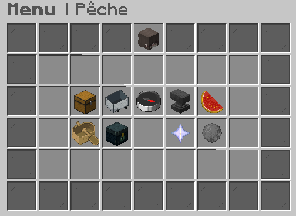

# 🎣 La pêche - A FAIRE

La pêche est l'une des compétences que vous pouvez développer sur votre île ou dans la zone prévue à cet effet au <mark style="color:red;">`/spawn`</mark>. Avec la commande <mark style="color:red;">`/peche`</mark>, vous serez téléporté(e) devant un PNJ nommé **Norbert**.&#x20;

En interagissant avec lui, vous ouvrirez l'interface de la pêche qui comporte plusieurs catégories :

<figure><figcaption></figcaption></figure>

🎣 <mark style="color:green;">Menus de la pêche</mark>

* <mark style="color:yellow;">**Coffre**</mark> : Ouvrir la boutique de vente de poissons.&#x20;

En ouvrant ce menu vous trouverez :&#x20;

→ en bas à gauche, le nom d'un "poisson spécial" indiquant sa rareté ainsi que son multiplicateur de vente, qui augmente le prix du poisson.                                                                                     → en bas à droite, les prix de tous les poissons en fonction de leur rareté.

* <mark style="color:yellow;">**Livraisons**</mark> : Ouvrir le menu des livraisons.

Les livraisons vous permettent de gagner des entropies et de l'argent. Une nouvelle livraison est proposée tous les 180 poissons pêchés et chaque livraison a une rareté spécifique influençant la quantité et la rareté des récompenses.&#x20;

Vous trouverez en bas du menu cinq items vous permettant d'améliorer les caractéristiques de vos livraisons tel que le nombre de poissons nécessaires pour une livraison ou encore l'augmentation du salaire.&#x20;

* La pesée : mettre un poisson dans l'emplacement, choisir un défi puis en fonction de ce défi (et en fonction des chances que ça marche), le poisson prend en valeur ou en perd (vidéo 1)
* Vente de poisson : vendre ses poissons (y'a les prix sur une feuille + certains poissons sont boostés)
* Livraisons : tu pêches certains poissons/items dans un temps à parti pou essayer de gagner des entropies. Tu peux acheter des améliorations pour les livraisons (plus de quêtes, réduire la quantité d'items, augmenter le salaire...)
* Codex : donne des infos sur tous les poissons en fonction de leur catégorie
* Compétences de pêche : pas la même chose que les skills (tu peux voir ton niv en passant ta souris sur le livre vert)
* Améliorations pêche : tu peux améliorer ta canne à pêche + **tu peux voir tes entropies sur le livre vert**
  * chaudron, items dedans, clic gauche (il faut avoir les info)
* /fish augment: Améliorer les compétences de pêche

Cliquer sur le livre vert Rassembler tout les ingrédients demandés, et les jeter dans un chaudron d'eau Clique droit avec la canne à pêche

<mark style="background-color:orange;">**Entropies, à expliquer**</mark>&#x20;

### <mark style="color:yellow;">Commandes</mark>

| Commandes | Descriptions   |
| --------- | -------------- |
| /peche    | Se téléporter  |

